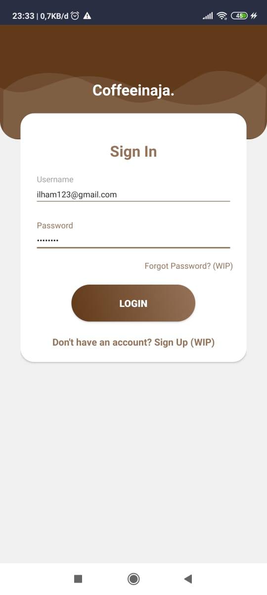
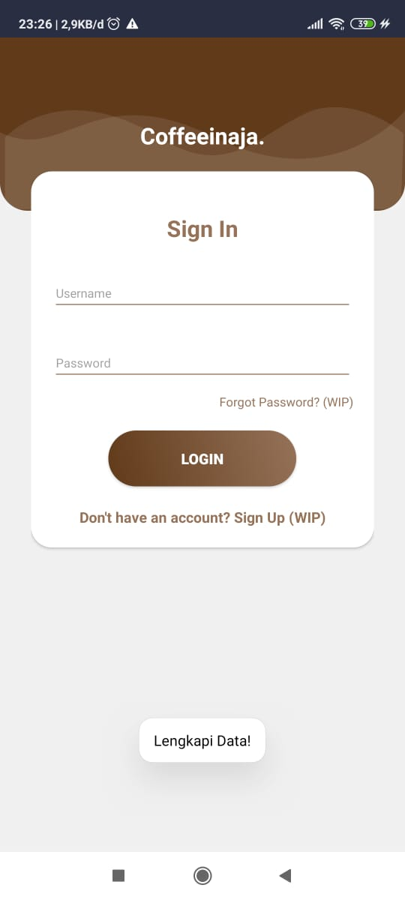
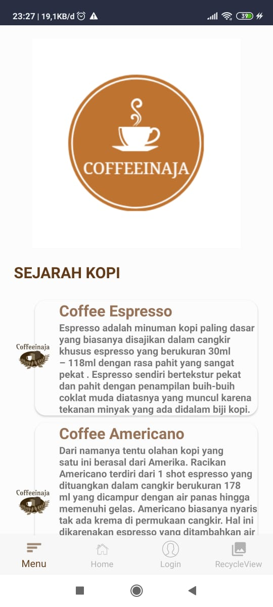
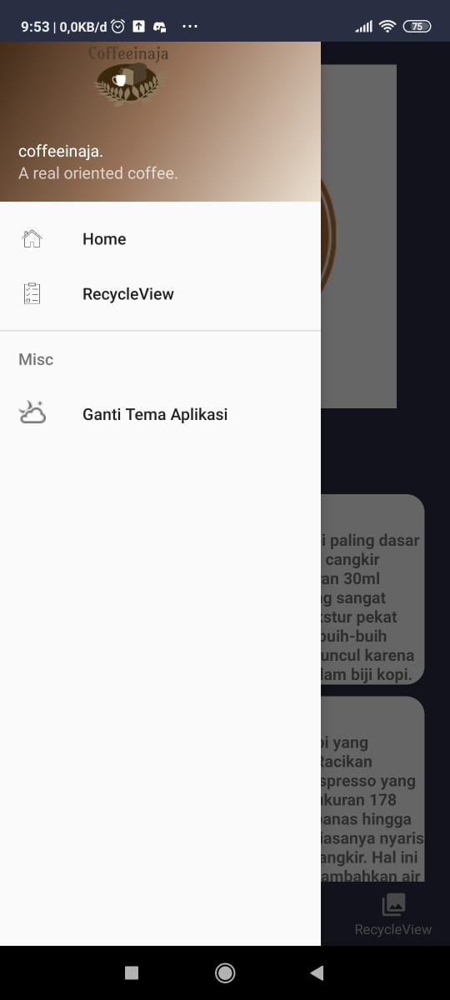
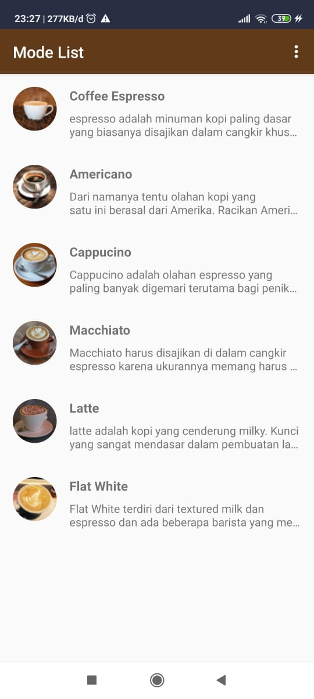
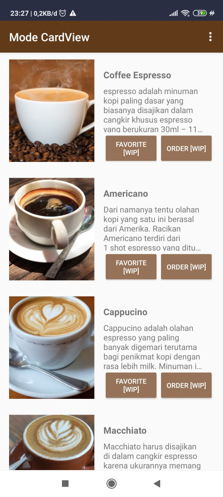
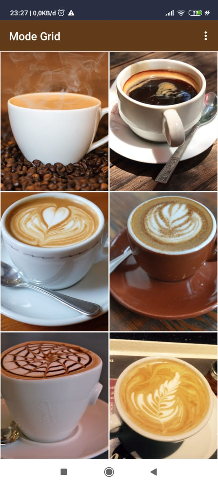

<!-- PROJECT LOGO -->
 

  

  <h3 align="center">Tugas Akhir Produktif - Coffeeinaja</h3>

  

    A real oriented coffee
     
    ·
    <a href="https://github.com/NextDvn/Tugas_Akhir_Produktif_XIRPL-Coffeeinaja">App Demo</a>
    ·
  

<!-- TABLE OF CONTENTS -->

  
Table of Contents

  <ol>
    <li>
      <a href="#about-the-project">About The Project</a>
    </li>
    <li>
      <a href="#built-with">Built With</a>
      <ul>
        <li><a href="#login-layout">Login Layout</a></li>
        <li><a href="#home-layout">Home Layout</a></li>
        <li><a href="#recycleview-layout">RecycleView Layout</a></li>
      </ul>
    </li>
        <li>
      <a href="#images">Images</a>
      <ul>
        <li><a href="#login">Login Images</a></li>
        <li><a href="#home">Home Images</a></li>
        <li><a href="#recycleview">RecycleView Images</a></li>
      </ul>
    </li>
        <li>
      <a href="#credits">Credits</a>
    </li>
        <li>
      <a href="#lisence">Lisences</a>
    </li>
  </ol>

<!-- ABOUT THE PROJECT -->
# About The Project

![Logo-Tugas][logo_tugas]

Aplikasi **Coffeeinaja** merupakan aplikasi yang menampilkan sejarah umum tentang kopi. Untuk sementara waktu ini dan karena kami baru memulai project ini _"mepet"_ dengan tenggat, sehingga aplikasi kami hanya menampilkan beberapa jenis kopi saja.

List kopi kami:
* ☕ Espresso
* ☕ American
* ☕ Cappucino
* ☕ Macchiato
* ☕ Latte
* ☕ Flat White

Kami juga menyediakan tampilan RecycleView dengan beberapa mode seperti, `List mode`, `Grid mode berupa gambar-gambar` dan `CardView mode dengan tombol [WIP]`

# Built With

Aplikasi kami menggunakan beberapa metode seperti:

#### Login Layout <a href="#login">see image »</a>
* Tampilan layout login menggunakan open source code
* Fungsi validasi TextInputLayout jika belum terisi maka akan menghasilkan pesan error
![Login-Fail-Code][login_fail_code]

<a href="https://appsnipp.com/free-login-registration-xml-design-for-android/">*credit</a>

#### Home Layout <a href="#home">see image »</a>
* Tampilan layout home menggunakan open source code
* Tampilan menu disamping menggunakan NavigationView dan tampilan menu dibawah menggunakan BottomNavigationView
* Fungsi NightMode yang dapat di toggle antara day/night mode
* Serta fungsi intent untuk perpindahan ke tiap activity

<a href="https://appsnipp.com/android-services-app-free-ui-design-with-dark-mode-source-code-included/">*credit</a>

#### RecycleView Layout <a href="#recycleview">see image »</a>
* Layout ListMode
* Layout GridView
* Layout CardView

# Images

##### LOGIN

  

##### HOME

  

##### RECYCLEVIEW

  

# Credits
[https://appsnipp.com/free-login-registration-xml-design-for-android/](https://appsnipp.com/free-login-registration-xml-design-for-android/)

[https://appsnipp.com/android-services-app-free-ui-design-with-dark-mode-source-code-included/](https://appsnipp.com/android-services-app-free-ui-design-with-dark-mode-source-code-included/)

[https://github.com/othneildrew/Best-README-Template](https://github.com/othneildrew/Best-README-Template)

# Lisence
Distributed under the AppSnipp License. See [LISENCE](https://appsnipp.com/license/) for more information.

Distributed under the MIT License. See [LISENCE](https://github.com/othneildrew/Best-README-Template/blob/master/LICENSE.txt) for more information.

<!-- MARKDOWN LINKS & IMAGES -->
<!-- https://www.markdownguide.org/basic-syntax/#reference-style-links -->
[logo]: images/logo.png
[logo_tugas]: app/src/main/res/drawable/logo.png
[login_fail_code]: images/login_fail_code.PNG
